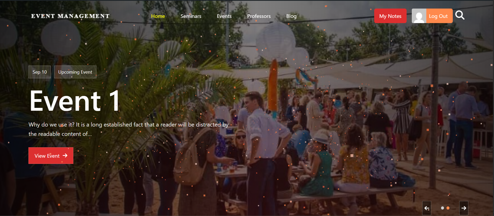

# Event Management Theme

A classic WordPress theme for managing events, seminars, professors, user notes, live search, custom login/register pages, and a polished front-page experience.

## Live Site

Production URL:

```text
https://event-management.ashrafisolutions.com/
```

## Screenshot



The project is intentionally split into two layers:

- Theme code in `wp-content/themes/event-management`
- Persistent data model code in `wp-content/mu-plugins`

This separation matters because custom post types, capabilities, taxonomies, and ACF field groups should not disappear when the theme is switched.

## Production Status

The theme has been reviewed for bootstrap flow, required pages, REST endpoints, login/register routing, escaping, nonce usage, frontend builds, and PHP syntax.

Current production notes:

- The required `mu-plugins` files must be deployed with the site.
- Advanced Custom Fields should be active for admin editing of custom fields. The frontend has fallbacks, but the admin editing experience is incomplete without ACF.
- `npm run build` passes. Webpack still warns about a large lazy-loaded vendor chunk from Three.js/GSAP.
- There is no automated test suite yet. Run the manual checklist before launch.

## Requirements

- WordPress 6.0+
- PHP 7.4+
- Node.js and npm for building frontend assets
- Advanced Custom Fields for custom field editing in the admin

## Installation

1. Place the theme directory here:

```text
wp-content/themes/event-management
```

2. Make sure these model files exist in `mu-plugins`:

```text
wp-content/mu-plugins/custom-post-type.php
wp-content/mu-plugins/theme-capabilities.php
wp-content/mu-plugins/acf-fields.php
wp-content/mu-plugins/professor-taxonomy.php
```

3. Install frontend dependencies and build assets:

```bash
npm install
npm run build
```

4. Activate the theme from the WordPress admin.

5. On activation, the theme creates or syncs:

- Required pages: `my-notes`, `past-events`, `search`, `login`, `register`
- The default Primary Menu
- Rewrite rules

## Data Model

Custom post types are registered in `mu-plugins/custom-post-type.php`:

- `event`
- `seminar`
- `professor`
- `note`
- `like`

Capabilities are managed in `mu-plugins/theme-capabilities.php`.

Professor fields are handled by a taxonomy:

- Taxonomy: `professor_field`
- Admin path: `Professors > Fields`
- Behavior: category-like and hierarchical
- Edit screen UI: checkbox list on professor edit pages

## ACF Field Groups

ACF field groups are registered in `mu-plugins/acf-fields.php` with `acf_add_local_field_group()`.

These are local PHP field groups. They may not appear as editable database-backed groups under `ACF > Field Groups`, but they are available on the relevant edit screens.

Important fields:

- `event_date` for events
- `professor_education` and `professor_age` for professors
- `seminar_professor` for connecting seminars to professors
- `page_banner_description` and `page_banner_background` for page banners

The old `professor_field` ACF field is deprecated. Professor fields now use the `professor_field` taxonomy.

## Theme Pages

Required page templates:

- `page-login.php`
- `page-register.php`
- `page-my-notes.php`
- `page-past-events.php`
- `page-search.php`

The custom `/login/` and `/register/` pages are integrated with redirects from `wp-login.php?action=login` and `wp-login.php?action=register`.

Registration respects the WordPress `Anyone can register` setting. If registration is disabled, the custom register form does not create users.

## Theme Settings

The settings page is available here:

```text
Appearance > Theme Settings
```

It currently manages banner images for:

- Global archives
- Events archive
- Seminars archive
- Professors archive

If no image is configured, the theme falls back to images in `assets/images`:

- `archive.png`
- `events.png`
- `seminars.png`
- `professors.png`

## Frontend

Main JavaScript entry:

```text
src/index.js
```

Important modules:

- `FrontPageExperience.js`: front page hero and sliders using Swiper, GSAP, and Three.js
- `Search.js`: live search overlay
- `myNotes.js`: user note management
- `professorLike.js`: professor likes
- `MobileMenu.js`: mobile navigation
- `eventsSlider.js`: legacy past-events slider

Build output is written to `build/` and enqueued from `functions.php`.

## REST API

Custom routes:

```text
GET    /wp-json/ataRoute/v1/search?keyword=...
POST   /wp-json/ataRoute/v1/like
DELETE /wp-json/ataRoute/v1/like
```

User notes use the native WordPress REST API for the `note` post type. The theme enforces the following with `rest_pre_insert_note` and `wp_insert_post_data` filters:

- The user must be logged in.
- Users can only edit their own notes.
- Notes are stored as private posts.
- Each user is limited to 5 notes.

## File Structure

```text
functions.php                 Main theme bootstrap
inc/template-helpers.php      Shared helper functions
inc/theme-activation.php      after_switch_theme orchestration
inc/page-setup.php            Required page creation
inc/navigation-setup.php      Default menu creation
inc/theme-settings.php        Theme settings page
inc/search_route.php          REST search endpoint
inc/Likes_route.php           REST like endpoints
inc/custom-login.php          Login/register routing
template-part/                Template partials
src/                          JavaScript and SCSS source
build/                        Production build output
```

## Pre-Deploy Checklist

- Disable `WP_DEBUG` on production.
- Deploy all required `mu-plugins` files.
- Keep ACF active if admins need to edit custom fields.
- Run `npm run build` and deploy the `build/` directory.
- Flush permalinks or ensure rewrite rules have been refreshed.
- Confirm these pages do not 404: `/login/`, `/register/`, `/my-notes/`, `/past-events/`, `/search/`.
- Confirm these archives open: `/events/`, `/seminars/`, `/professors/`.
- Confirm `Professors > Fields` is available in the admin.
- Test registration with the WordPress `Anyone can register` setting both enabled and disabled.
- Test note create/update/delete as a normal user.
- Test professor like/dislike as a normal user.
- Test the live search overlay and the fallback `/search/` page.
- Test the front page for console errors.

## Development Commands

```bash
npm run build
npm run start
```

PHP syntax check:

```powershell
Get-ChildItem -Recurse -Filter *.php | Where-Object { $_.FullName -notlike '*\node_modules\*' } | ForEach-Object { php -l $_.FullName }
```

## Maintenance Notes

- Keep custom post types and capabilities in `mu-plugins`, not in the theme.
- If a taxonomy or post type changes, bump the relevant internal version and flush rewrite rules once.
- If the theme needs a new ACF field, register it in `mu-plugins/acf-fields.php`.
- If the theme needs a new required page, add it to `inc/page-setup.php`.
- Avoid generic `.swiper` selectors for new sliders. Each slider should have a dedicated class.
